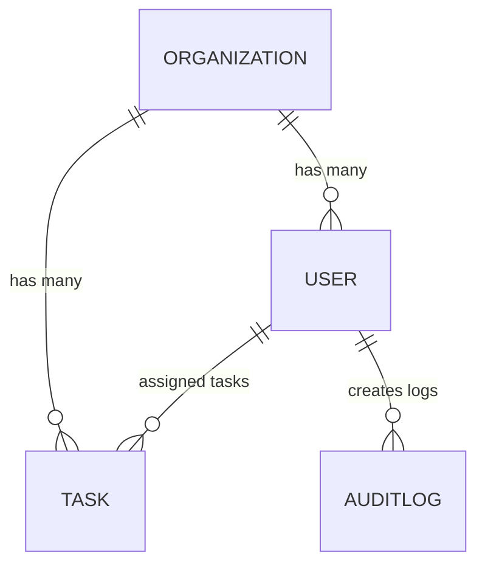

# 🚀 Task Scheduler  
A full-stack task management platform built with **Nx**, **NestJS**, **Angular**, **TypeORM**, **JWT Authentication**, and **TailwindCSS**.


**Author:** Brandon Nance

---

# 📚 Table of Contents

- [Overview](#overview)  
- [Tech Stack](#tech-stack)  
- [Features](#features)  
- [Architecture](#architecture)  
- [Data Models](#data-models)  
- [ERD](#erd)  
- [Authentication & Access Control](#authentication--access-control)  
- [API Reference](#api-reference)  
- [Frontend Overview](#frontend-overview)  
- [Setup Instructions](#setup-instructions)  
- [Frontend Demo & Screenshots](#frontend-demo--screenshots)  
- [Future Considerations](#future-considerations)  
- [Screenshots](#screenshots)

---

# 📌 Overview

The **Task Scheduler** is a role-based, organization-scoped task management application built inside an Nx monorepo. It includes:

- Secure JWT login  
- Full RBAC permission system (Owner / Admin / Viewer)  
- Multi-organization scoping  
- CRUD operations for tasks  
- Audit logging  
- Angular UI with TailwindCSS  
- Dark/Light Mode  
- Status breakdown visualization  

_No drag-and-drop functionality is included in this implementation._

---

# 🛠 Tech Stack

### **Backend**
- NestJS (REST API)
- TypeORM
- SQLite
- JWT Authentication
- RBAC via Nest Guards

### **Frontend**
- Angular (Standalone components)
- TailwindCSS
- LocalStorage-based JWT handling

### **Monorepo**
- Nx Workspaces
- Shared libs for entities and auth types

---

# ⭐ Features

### **Authentication**
- Email + password login  
- JWT token generation + verification  

### **Role-Based Access Control**
- Owner → full system access  
- Admin → full organization access  
- Viewer → read-only  

### **Task Management**
- View tasks by status  
- Create, edit, delete tasks  
- Tasks scoped to user’s organization  

### **Audit Logging**
- Records all create/update/delete operations  
- Admin/Owner-only access  

### **UI Enhancements**
- Light/Dark mode toggle  
- Responsive layout  
- Status visualization bar  

---

# 🏗 Architecture

### **Monorepo Layout**

```
apps/
  api/          # NestJS backend
  dashboard/    # Angular frontend

libs/
  data/         # Entities, enums, permissions
  auth/         # Auth DTOs and interfaces
```

### **Backend Architecture**
Modules:
- AuthModule  
- TasksModule  
- AuditLogModule  
- OrganizationsModule  
- UsersModule  

Guards handle RBAC and org-level scoping.

### **Frontend Architecture**
- Angular standalone components  
- Auth stored in localStorage  
- API services for Tasks and Auth  
- Styled with TailwindCSS  

### **Why Nx?**
- Single workspace  
- Unified scripts and tooling  
- Ability to share TypeScript models  

---

# 🧱 Data Models

### **User**
```
id: string
name: string
email: string
passwordHash: string
role: OWNER | ADMIN | VIEWER
organizationId: string
```

### **Organization**
```
id: string
name: string
parentId?: string
```

### **Task**
```
id: string
title: string
description?: string
status: OPEN | IN_PROGRESS | DONE
dueDate?: Date
assigneeId?: string
organizationId: string
createdAt: Date
updatedAt: Date
```

### **AuditLog**
```
id: string
userId: string
role: string
action: string
endpoint: string
timestamp: Date
```

---

# 📐 ERD



---

# 🔐 Authentication & Access Control

### **Permission Matrix**

| Role   | View Tasks | Create | Edit | Delete | Audit Logs |
|--------|------------|--------|------|--------|------------|
| **OWNER** | ✔ | ✔ | ✔ | ✔ | ✔ |
| **ADMIN** | ✔ | ✔ | ✔ | ✔ | ✔ |
| **VIEWER** | ✔ | ✖ | ✖ | ✖ | ✖ |

---

# 📡 API Reference

Base URL:
```
http://localhost:3000/api
```

---

## 🔐 POST /auth/login

### Request
```json
{
  "email": "admin@example.com",
  "password": "password123"
}
```

### Response
```json
{
  "access_token": "..."
}
```

---

## 📌 GET /tasks

### Response
```json
[
  {
    "id": "123",
    "title": "Prepare project briefing",
    "status": "OPEN",
    "organizationId": "ORG-A"
  }
]
```

---

## 📝 POST /tasks

### Request
```json
{
  "title": "New Task",
  "status": "OPEN",
  "organizationId": "ORG-A"
}
```

### Response
```json
{
  "id": "abc",
  "title": "New Task",
  "status": "OPEN"
}
```

---

## ✏️ PUT /tasks/:id

### Request
```json
{
  "title": "Updated Task",
  "status": "IN_PROGRESS"
}
```

### Response
```json
{
  "id": "abc",
  "title": "Updated Task",
  "status": "IN_PROGRESS"
}
```

---

## ❌ DELETE /tasks/:id

### Response
```json
{
  "success": true,
  "deletedId": "abc"
}
```

---

## 👤 POST /users

Protected by `users.manage` permission (OWNER role by default).

### Request
```json
{
  "email": "new.user@example.com",
  "password": "Password123!",
  "name": "New User",
  "organizationId": "ORG-A",
  "roleName": "ADMIN"
}
```

### Response
```json
{
  "id": "user-id",
  "email": "new.user@example.com",
  "name": "New User",
  "organizationId": "ORG-A",
  "role": {
    "id": "role-id",
    "name": "ADMIN"
  }
}
```

---

# 🎨 Frontend Overview

- Angular standalone components  
- TailwindCSS styling  
- Dark/Light mode  
- Task status visualization bar  
- JWT authentication  

---

# 🧰 Setup Instructions

1. Install deps: `npm install`
2. Export `JWT_SECRET` before starting the API (must be the same for issuing and validating tokens), then run the backend (e.g., `npm run start` / `nx serve api`) and frontend as usual.
3. Seeded owner user: `owner@example.com` / `password123` — use this to obtain a token with `users.manage` for creating users via `POST /api/users`.

---

# 🎬 Frontend Demo & Screenshots

Task Scheduler – role-based task management demo with a clean Angular + Tailwind UI (light/dark theme, Kanban-style dashboard, statistics, and inline editing).

## 🚀 Frontend features

- 🔐 Demo authentication (email + password)
- 🌗 Light & Dark Mode toggle
- 🧱 Kanban layout – Open / In Progress / Done
- ✏️ Inline task editing
- ➕ Task creation panel
- 📊 Completion & status metrics
- 📱 Responsive centered “app window” layout
- 🎨 Theme-driven UI with Tailwind utility patterns

## ▶️ Frontend quickstart

```bash
ng serve          # or: npx nx serve task-scheduler
# then visit http://localhost:4200
```

---

# 🧭 Future Considerations

### **1. Trello-Style Custom Status Columns**  
### **2. Drag & Drop (Angular CDK)**  
### **3. Real-Time WebSockets Collaboration**  
### **4. Admin UI for Organizations**  
### **5. Advanced Analytics & Charts**  
### **6. Postgres Migration**  

---

# 🖼 Screenshots


> Place the PNG files inside a `/screenshots` folder in your repo.
