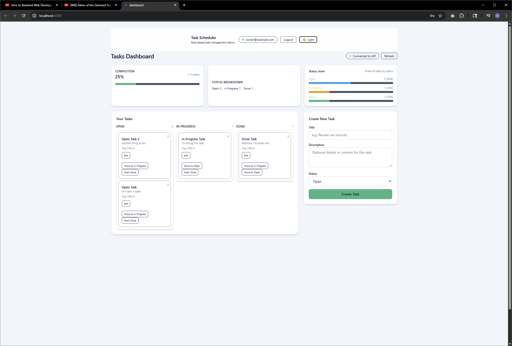

# Task Scheduler – Role-based Task Management Demo

A clean, modern Angular + Tailwind demo showcasing authentication, a Kanban-style task dashboard, statistics, and a light/dark theme system.

---

## 📸 Screenshots

### **Login – Dark Theme**


### **Dashboard – Dark Theme**


### **Dashboard – Light Theme**


> Place the PNG files inside a `/screenshots` folder in your repo.

---

## 🚀 Features

- 🔐 **Authentication** (email + password)
- 🌗 **Light & Dark Mode** toggle
- 🧱 **Kanban Layout** – Open / In Progress / Done
- ✏️ Inline task editing
- ➕ Task creation panel
- 📊 Completion & status metrics
- 📱 Fully responsive centered layout  
- 🎨 Clean theme-driven UI with @apply utilities in SCSS

- Drag/Drop functionality not implemented due to time constraints.  

---

## 🛠 Tech Stack

- **Angular 17+** (standalone components)
- **TypeScript**
- **SCSS with Tailwind utility patterns**
- **Node.js (LTS)**

---

## 📦 Installation

### 1. Clone the repository

```bash
git clone https://github.com/brandonnance/bnance-7f3b2b2e-1c8c-4e1e-9c79-2c4e7a4afb0e.git
cd <your-project-folder>
```

### 2. Install dependencies

```bash
npm install
# or
pnpm install
# or
yarn
```

### 3. Start the dev server

Nx:

```bash
npx nx serve api
npx nx serve dashboard
```

Then visit:

```
http://localhost:4200
```

---

## 📁 Project Structure

```
apps/
  api/
    src/
      main.ts
      app/
        access-control
        audit-log
        auth
        entities
        tasks
        app.controller.ts
        app.module.ts
        app.service.ts
dashboard/
  src/
    styles.scss   <- global SCSS (themes + utilities)
    app/
      auth
      tasks
      app.html
      app.ts
screenshots/  <- screenshot PNGs
dev.sqlite   <- dev DB
```

---

## 📝 Notes on Screenshots

Your repo should contain:

```
screenshots/
  Screenshot-2025-11-17-093806.png
  Screenshot-2025-11-17-093814.png
  Screenshot-2025-11-17-093823.png
```

GitHub will automatically render them in this README.

---


